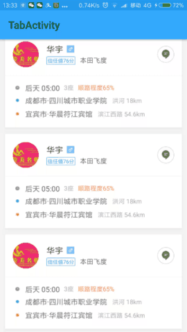

# 滴滴、支付宝刷新（怎么让刷新在滚动范围内进行，而不是顶部或底部）
### 废话不多说，先上效果
 
 
<br/>

## 说明
以上效果均由PullRefreshLayout（稍微详细的说明见：[https://github.com/genius158/PullRefreshLayout](https://github.com/genius158/PullRefreshLayout)）实现。
使用PullRefreshLayout，自定义header和footer你可以实现很多你想的到的功能.

##### 回弹刷新库(PullRefreshLayout)说明：个人最用心，用时写的一个库（出发点：其他的库回弹效果都并不理想，便想起了做这一个库），个人水平有限，开发的过程总是曲折的，大概3个多月后才正式在公司的项目中使用本库，其中也相应的修改了很多小问题，到现在应该相对很稳定了吧（>_<|||）（至少目前个人的项目用着是没有问题了的）

#### 问题
想实现，在整体都可以滚动的，滚动区域实现刷新，正经的做事很麻烦的事情，用两个ScrollView嵌套，那么滑动冲突处理，会让你绞尽脑汁，
用behavior,nestedScroll，因为滑动（没有触摸的时候）是不会传递的，是做不到像整体滑动那样平滑的过度的，然而使用PullRefreshLayout，自定义header，你可以轻易的实现这个效果

#### 1.滴滴刷新([DiDiHeader](https://github.com/genius158/PullRefreshLayout/blob/master/app/src/main/java/com/yan/refreshloadlayouttest/widget/DiDiHeader.java))
首先创建一个header实现PullRefreshLayout.OnPullListener
<br/>
<br/>
1.header 的 布局

```
<RelativeLayout xmlns:android="http://schemas.android.com/apk/res/android"
    ... />
    <!--头部loading View 部分-->
    <com.yan.refreshloadlayouttest.widget.ClassicsHeader
        android:layout_alignBottom="@+id/fixed_top"
        ... />
    <!--头部布局部分-->
    <com.yan.refreshloadlayouttest.widget.PercentImageView
        android:id="@+id/fixed_top"
         ... />
</RelativeLayout>
```
这里用了相对布局，保证 loadingView 与头部布局部分的底部对齐，且在其后面

<br/>
2.prl初始化部分一

```
setLayoutParams(new ViewGroup.LayoutParams(-1, -1));//-1 就是match_parent
prl.setHeaderShowGravity(ShowGravity.PLACEHOLDER);
prl.setHeaderFront(false);
```

先设置header的高度宽度为match_parent,在设置header为固定模式,为了方便处理事件使其后置
<br/>
<br/>
3.初始化部分二，代码太对直接看注释
```
post(new Runnable() {//这里是为了保证prl初始化完成，同时方便获取高度
    @Override
    public void run() {
        View target = prl.getTargetView();//拿到targetView
        prl.setRefreshTriggerDistance(loadingView.getHeight());//设置prl的刷新触发距离为loadingView 的高度
        target.setOverScrollMode(OVER_SCROLL_NEVER);
        target.setPadding(target.getPaddingLeft()
                , fixedHeader.getHeight() // 设置滚动布局的padding，top部分就是header的高度，使得header完全显示
                , target.getPaddingRight()
                , target.getPaddingBottom());

        // 具体target处理，主要区别滑动逻辑
        if (target instanceof NestedScrollView) {
            //设置滑动监听，
            ((NestedScrollView) target).setOnScrollChangeListener(DiDiHeader.this);
            //滑动监听的具体代码:
            //scrollTo(0, scrollY);使得header跟随滚动布局target滑动
            //(view.setTranslationY(-scrollY)不会更新header的点击位置,可能是header被其他view完全覆盖,所以系统默认不更新)
            
            //设置不切割子View
            ((NestedScrollView) target).setClipToPadding(false);
        }//else if target instanceof RecyclerView ...
    
        // 因为header在滚动布局target的后面，接收不到具体事件，需要重新分发
        target.setOnTouchListener(new OnTouchListener() {
            @Override
            public boolean onTouch(View v, MotionEvent event) {
                DiDiHeader.this.dispatchTouchEvent(event);//因为header在最底层,主动给header进行事件分发
                return false;
            }
        });

    }
});
```

<br/>
4.prl 的onPullChange 

```
public void onPullChange(float percent) {
    loadingView.setTranslationY(prl.getMoveDistance());
}
```
这里就直接对loadingView进行跟随移动
