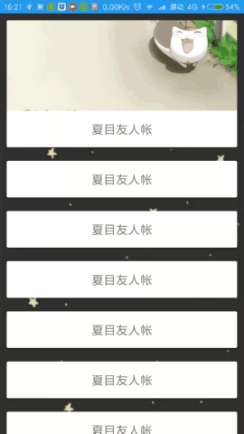
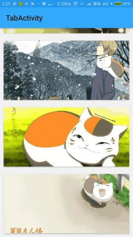
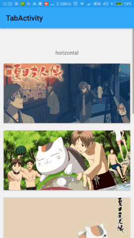

# 二级（二楼、顶楼）刷新，SlidingDownPanelLayout
### 废话不多说，先上效果
 
 
<br/>
 
 
<br/>

## 说明
以上效果均由PullRefreshLayout（稍微详细的说明见：[https://github.com/genius158/PullRefreshLayout](https://github.com/genius158/PullRefreshLayout)）实现。
#### 1.二级刷新的实现
首先创建一个header实现PullRefreshLayout.OnPullListener
<br/>
1.初始化部分
```
setLayoutParams(new ViewGroup.LayoutParams(-1, -1));//-1 就是match_parent
firstRefreshTriggerDistance = TwoRefreshHeader.this.pullRefreshLayout.getRefreshTriggerDistance();
twoRefreshDistance = firstRefreshTriggerDistance * 2;

translateYAnimation = ValueAnimator.ofFloat(0, 0);
translateYAnimation.setDuration(TWO_REFRESH_DURING);
translateYAnimation.setInterpolator(new ViscousInterpolator());// ViscousInterpolator是prl默认的插值器
translateYAnimation.addUpdateListener(new ValueAnimator.AnimatorUpdateListener() {
    @Override
    public void onAnimationUpdate(ValueAnimator animation) {
        float m = (float) animation.getAnimatedValue();
        pullRefreshLayout.moveChildren((int) m);// 移动prl
    }
});
```
换行之前：先设置header的高度宽度为match_parent，再记住PullRefreshLayout（以下简称prl）设置的初始一级刷新的距离（因为二级刷新需要重新设置刷新触发距离）。
<br/>
换行之后：translateYAnimation是一个回复动画，当header显示完全后，由于prl处于刷新状态下并不会执行refresh动画，所以需要translateYAnimation来实现refresh动画的效果
<br/>
<br/>
2.一级刷新触发的时候
```
public void onPullHolding() { 
    if (pullRefreshLayout.getMoveDistance() >= twoRefreshDistance) {
        pullRefreshLayout.setPullDownMaxDistance(getHeight() * 2);
        pullRefreshLayout.setRefreshTriggerDistance(getHeight());
        pullRefreshLayout.setRefreshAnimationDuring(TWO_REFRESH_DURING);
        pullRefreshLayout.setDispatchPullTouchAble(false);
        pullRefreshLayout.setTwinkEnable(false);
        ...
    }
}
```
说明： onPullHolding()的执行在refresh动画开始之前，而onRefresh()在refresh动画开始时执行
<br/>
if语句判读的是是否处可以触发二级刷新，
<br/>
setPullDownMaxDistance(getHeight() * 2)这里重设向下拖拽的最大距离，这样prl在header完全显示的情况下仍可以向下拖拽
<br/>
setRefreshTriggerDistance(getHeight())这里就是二级刷新的核心，更改了刷新触发的拖拽距离，这样refresh动画就会呈现完全展开的样式
<br/>
setRefreshAnimationDuring(TWO_REFRESH_DURING)设置refresh动画的时间
<br/>
setDispatchPullTouchAble(false)为了保证refresh动画不被打断，使得header完全显示出来
<br/>
setTwinkEnable(false)处于二级刷新状态下取消回弹，使得回复动画不会混乱
<br/>
<br/>
3.prl移动执行的逻辑,onPullChange(percent)
```
if (pullRefreshLayout.getMoveDistance() >= getHeight()) {// getHeight() 为二级刷新重新设置的距离
    pullRefreshLayout.setDispatchPullTouchAble(true);
    isTwoRefresh = true;
}

if (!isTwoRefresh) {// 处于二级刷新的状态下才执行以下的二级刷新的相关逻辑
    return;
}
if (percent <= 0 && !pullRefreshLayout.isHoldingFinishTrigger()) {
    pullRefreshLayout.refreshComplete();
}
if (pullRefreshLayout.getMoveDistance() > getHeight() - firstRefreshTriggerDistance) {
    if (!pullRefreshLayout.isDragDown() && !pullRefreshLayout.isDragUp()) {
        translateYAnimation.setFloatValues(pullRefreshLayout.getMoveDistance(), getHeight());
        translateYAnimation.start();
    } else if (translateYAnimation.isRunning()) {
        translateYAnimation.cancel();
    }
} else if (!pullRefreshLayout.isDragDown() && !pullRefreshLayout.isDragUp()) {
    pullRefreshLayout.refreshComplete();
}
```
这里稍微有点复杂，当header显示完全执行setDispatchPullTouchAble(true)，恢复prl默认的手势，并设置二级刷新标识isTwoRefresh为true表示处于二级刷新状态下
<br/>
&emsp;&emsp;二级刷新的状态下（if (!isTwoRefresh) { ， 之后）：
<br>
if (percent <= 0 && !pullRefreshLayout.isHoldingFinishTrigger()) { ，这里是拖拽出footer，又处在二级刷新的状态下时候，pullRefreshLayout.refreshComplete()结束二级刷新状态（不结束的话，prl默认的回复动画就不会触发）
<br>
if (pullRefreshLayout.getMoveDistance() > getHeight() - firstRefreshTriggerDistance) { ，二级刷新是否需要结束的判断，
<br>
if (!pullRefreshLayout.isDragDown() && !pullRefreshLayout.isDragUp()) { ，这里判断是否处在onTouch（手指触摸屏幕）状态，如果没有且二级刷新不需要结束，则执行translateYAnimation的回复动画，使得header回到完全显示的状态；如果处在onTouch状态，如果translateYAnimation正在执行，则cancel掉translateYAnimation
<br>
最后一个else if 判断处在二级刷新需要结束且又不在onTouch的状态下，结束二级刷新

