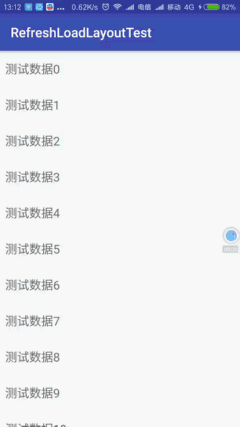

# PullRefreshLayout
#


## 1.概述
纯嵌套滑动实现无痕过度上拉加载、下拉刷新(支持自定义头部和尾部),支持边界回弹效果

### gradle 

## 2.说明  
该控件作用于，实现了NestedScrollingChild的控件（例如: recycleView、NestedScrollView）
,其他控件需要实现NestedScrollingChild可参考（[PullListView.java](https://github.com/genius158/RefreshLayout/blob/master/pullrefreshlayout/src/main/java/com/yan/pullrefreshlayout/view/PullListView.java)、[PullScrollView.java](https://github.com/genius158/RefreshLayout/blob/master/pullrefreshlayout/src/main/java/com/yan/pullrefreshlayout/view/PullScrollView.java)）

```
//-控件设置-
    refreshLayout.autoRefresh();// 自动刷新
    refreshLayout.setOverScrollDampingRatio(0.4f);//  值越大overscroll越短
    refreshLayout.setAdjustTwinkDuring(2);// 值越大overscroll越慢 default 2
    refreshLayout.setScrollInterpolator(interpolator);// 设置scroller的插值器
    refreshLayout.setLoadMoreEnable(true);// 上拉加载是否可用 default false
    refreshLayout.setDuringAdjustValue(10f);// 动画执行时间调节，越大动画执行越慢 default 10f
    // 刷新或加载完成后回复动画执行时间，为-1时，根据setDuringAdjustValue（）方法实现 default 300
    refreshLayout.setRefreshBackTime(300);
    refreshLayout.setDragDampingRatio(0.6f);// 阻尼系数 default 0.6
    refreshLayout.setPullFlowHeight(400);// 拖拽最大范围，为-1时拖拽范围不受限制 default -1
    refreshLayout.setRefreshEnable(false);// 下拉刷新是否可用 default false
    refreshLayout.setPullTwinkEnable(true);// 回弹是否可用 default true 
    refreshLayout.setAutoLoadingEnable(true);// 自动加载是否可用 default false
    
    // headerView和footerView需实现PullRefreshLayout.OnPullListener接口调整状态
    refreshLayout.setHeaderView(headerView);// 设置headerView
    refreshLayout.setFooterView(footerView);// 设置footerView
    
    // PullRefreshLayout.OnPullListener
        public interface OnPullListener {
            // 刷新或加载过程中位置相刷新或加载触发位置的百分比，时刻调用
            void onPullChange(float percent);
            void onPullReset();// 数据重置调用
            void onPullHoldTrigger();// 拖拽超过触发位置调用
            void onPullHoldUnTrigger();// 拖拽回到触发位置之前调用
            void onPullHolding(); // 正在刷新
            void onPullFinish();// 刷新完成
        }
```
